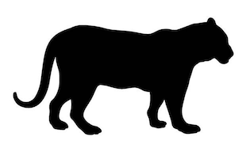
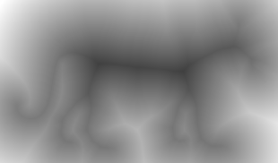
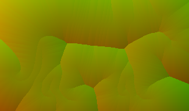
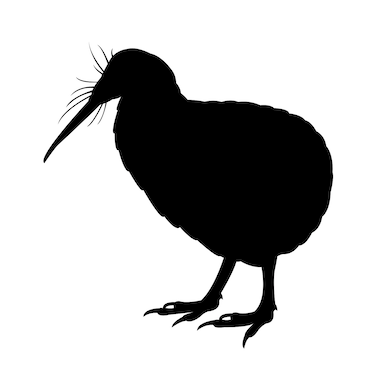
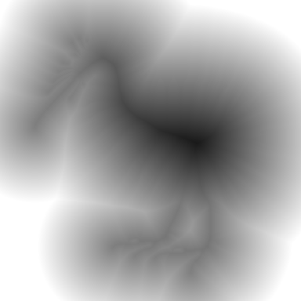
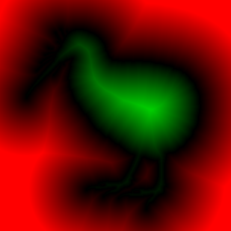
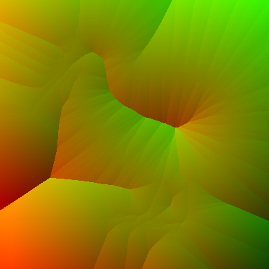

Distance/Occlusion Library + Tool
===============

The DistanceOcclusionLib.* files here implement a number of algorithms for

* Distance field generation
* Signed distance field generation
* Scalar and directional occlusion generation

for both 2d (images) and 3d (volumes). Bitmask inputs are supported to keep
memory overhead down, which is particularly important for volumes.

The included tool, distocc, which uses this lib, will process 2D images or 3D
.obj files, and can output the results in a number of different formats. By
default the tool uses the 'Danielsson' algorithm, and signed border
initialisation, in order to generate accurate results as quickly as possible,
but other algorithms can be be selected via -m (see below). These include:

    FastSweep        O(n), most accurate delta technique
    Danielsson       O(n), ~30% faster than FastSweep, decent accuracy
    JumpFlood        O(n log n), GPU-oriented algorithm, included to check accuracy
    BruteForce       O(n^2), exact, for checking other algorithms at low n.
    Chamfer          O(n), has issues on diagonals. Cheapest but quality suffers.
    Felzenszwalb     O(n) but much larger overhead than the others. Accurate.

The first four algorithms provide deltas from cell to closest point, which can
be used to evaluate distance, but also to answer nearest-point queries, or
generate Voronoi diagrams. The last two are strictly distance-only. Finally,
signed distances can be optionally generated via the more classic two-pass
interior/exterior algorithm, but this is twice as slow and uses twice as much
memory as the default.

A reasonably efficient mesh voxeliser is included in the support file
MeshSupport.cpp.

Building and Running
--------------------

To build the tool, run

    c++ DistanceOcclusionTool.cpp DistanceOcclusionLib.cpp -o distocc

Then to see the tool options run

    ./distocc

which should give you something like:

    Options:
      -d: generate distance field. Methods: 0, Danielsson; 1, Fast Sweep; 2, Jump Flood; 3, Brute Force; 4, Chamfer; 5, Felzenszwalb
      -s: generate signed distance field in a single pass. Methods: as for -d but Chamfer/Felzenszwalb unsupported.
      -S: generate signed distance field via orthodox two distance field passes.
      -x: generate occlusion. Methods 0: standard, 1: no self-occlusion, 2: directional components only

      -m <int>: select method variant for above

      -w <w:int> [<h:int>]        : set dimensions of image source
      -W <w:int> [<h:int> <d:int>]: set dimensions of volume source
      -p [<count:int> <seed:int>] : add random points to image/volume (default)
      -b <sides:int>              : add test box with the given number of sides to image/volume

      -f <path>: specify input image
      -t <int> : specify 0-255 threshold for creating mask from image
      -r       : reverse so white is occupied rather than black

      -F <path>: use given obj file to define mask.

      -o <name>: set base name for output file(s)
      -v       : log detailed output
      -c       : run checks on output

E.g.,

    ./distocc -d -p 100               # Generate a DF for 100 random points
    ./distocc -d -W 16 -b 6           # Generate a DF for a test box within a 16^3 volume
    ./distocc -s -f data/tiger.png    # Generate an SDF for the given image
    ./distocc -d -W 32 -F data/plant2.obj # Generate a 32^3 DF for the given 3D mesh

On Windows just include these files in your visual studio project. The code has
been tested under clang, gcc, and Visual C.

Examples
--------

From left to right: original, signed distance with zero at 0.5,
red/green SDF, delta vectors to closest boundary point.

